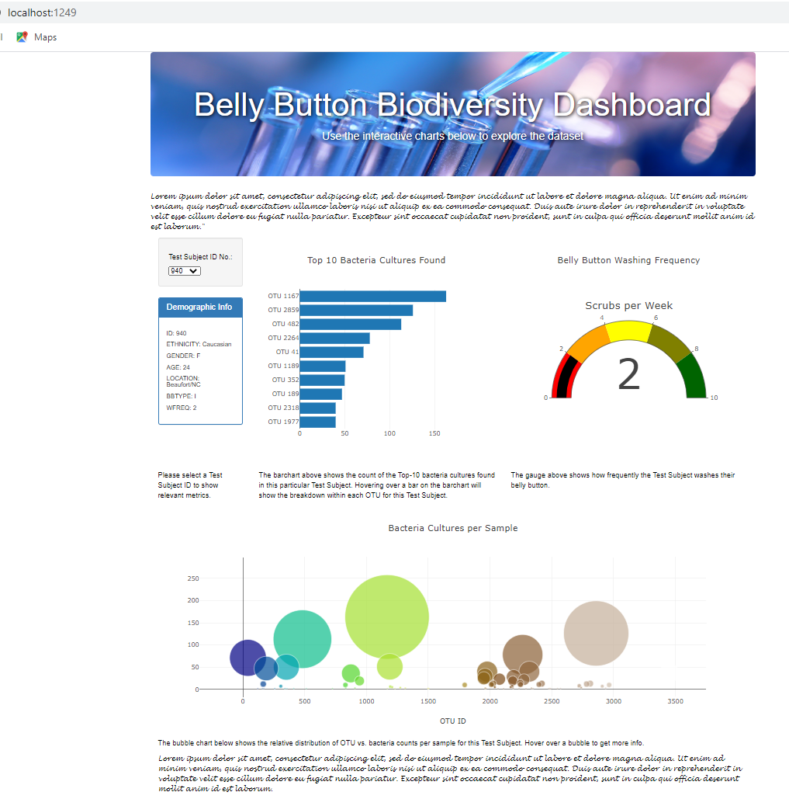
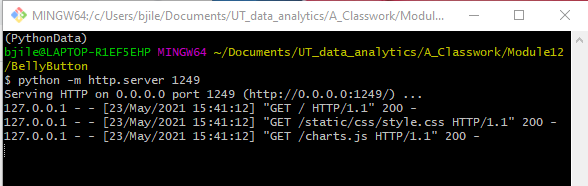
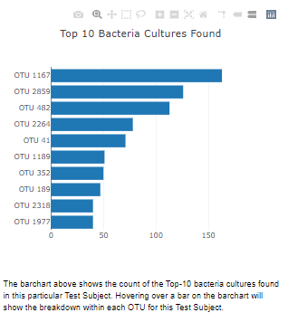
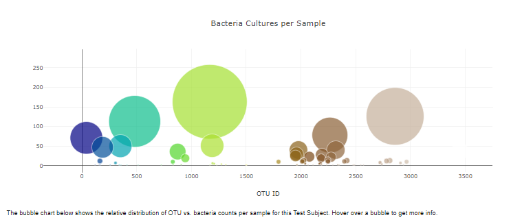
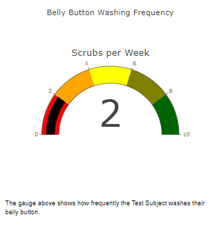
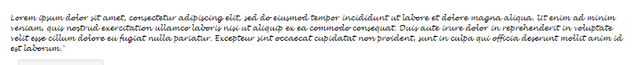
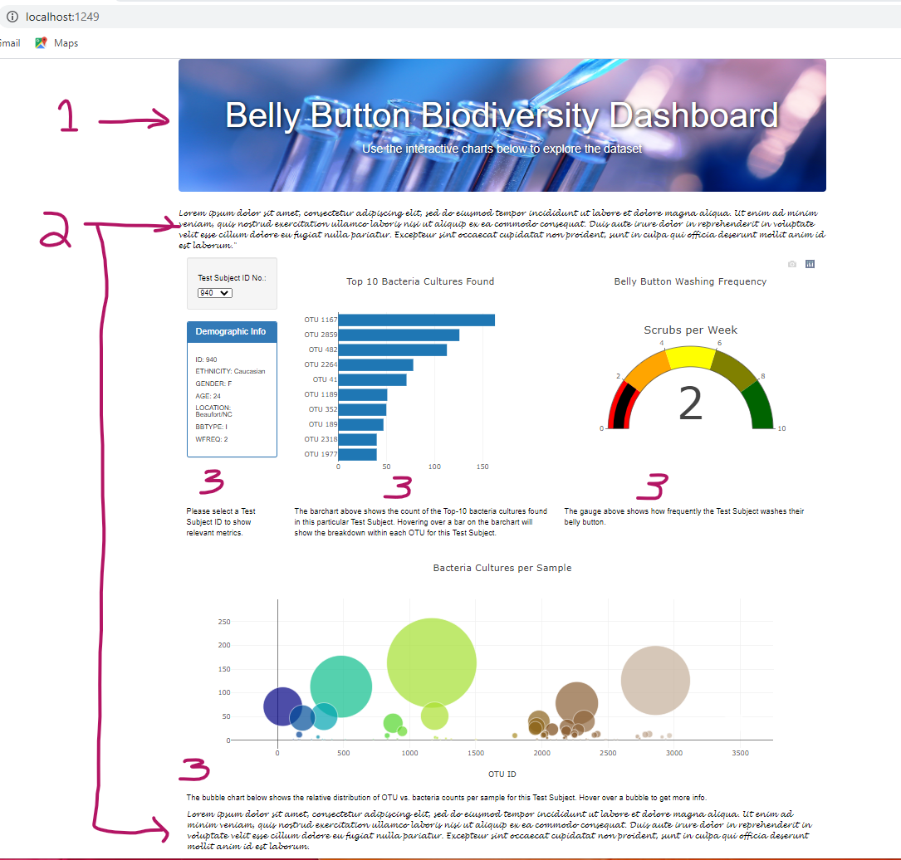

# Bellybutton

## Project Overview

Rosa is a biological researcher in a prominent microbiology laboratory.
Many bacteria species are not well studied, and others are unknown to science.
Rosa's role is to discover and document these kinds of bacteria.
In particular, Rosa is interested in bacteria that can synthesize proteins that taste like beef.
Her lab has partnered with Improbable Beef, a food startup, to research candidate species.
Rosa has a theory that such bacteria can be found on the human body.
She believes that the ideal bacterial species can be found in the human belly button.

Rosa has conducted a study where test subjects are assigned an ID number.
The bacterial cultures from participants' belly buttons are contained in her experiment database.
We helped Rosa create a dashboard so study participants as well as fellow researchers can investigate the data.

Technologies Used:
- Javascript
- Plotly
- Bootstrap Javascript Library
- D3 (Data Driven Documents Javascript Library)
- HTML / CSS
- JSON

This project source code and README file is hosted on GitHub at the following URL:

```
https://github.com/jilek/BellyButton
```

The 'live' finished product is accessible via the following URL:

```
https://jilek.github.io/BellyButton
```

## Results

The finished website is shown in Figure 1 below. This page has several components, which will be described in greater detail below.

Figure 1. The finished website.



Note that since our Javascript code for this project reads a JSON data file from the local filesystem, which generates Cross-Origin Resource Sharing (CORS) errors when run from a local browser. So we had to use our own web server, in this case we used the default Python http server, as shown in Figure 2 below. Also note that the URL bar in our Chrome browser shown in Figure 1 above is accessing the web page on localhost at the port specified:

```
http://localhost:1249
```

Figure 2. The Python sample http server.



#### Deliverable 1: Create a Horizontal Bar Chart

The bar chart is shown in Figure 3 below. Note that there is also a customization for Deliverable 4, which in this case is a paragraph of text below the barchart that explains what it is.

Figure 3. The horizontal bar chart.



#### Deliverable 2: Create a Bubble Chart

The bubble chart is show in Figure 4 below.

Figure 4. The bubble chart.



Note that it took quite a while to discover that the {colorscale: "Earth"} was used for the bubblechart 'marker' items that match the sample given on our BootcampSpot example.

#### Deliverable 3: Create a Gauge Chart

The gauge / indicator chart is show in Figure 4 below.

Figure 4. The gauge / indicator chart.



#### Deliverable 4: Customize the Dashboard

The customizations I chose to make are:

##### 1. Jumbotron background image as shown in Figure 5 below.

Figure 5. Jumbotron background image.


This background image was borrowed from our BootcampSpot website for this module.

##### 2. Jumbotron foreground text with drop-shadow and blur also shown in Figure 5 above.

I also added foreground text. These were added directly in the HTML. The foreground text was customized with a drop shadow and blur via static/css/style.css.

##### 3. Extra text with custom font as shown in Figure 6 below.

Figure 6. Custom font and extra descriptive text.



This block of text was embedded as an extra Bootstrap col-md12 row, and the text customizations were done in static/css/style.css.

##### 4. Additional descriptive text paragraphs as shown in Figure 7 below.

Figure 7. Extra text paragraphs added inside Bootstrap <div> tags.



- Note 1 shows the customizations done to the Jumbotron component.
- Note 2 shows the CSS customizations to paragraphs using a cursive font.
- Note 3 shows the extra text paragraphs added inside the Bootstrap <div> components.

## Summary

This was a fairly involved project, and again the actual time to complete it was significantly greater than the estimated completion time. It was interesting to learn how to handle CORS errors, and how to host GitHub 'Pages'. The Plotly library was much more complicated than expected, and getting those components right also consumed a large amount of time.
